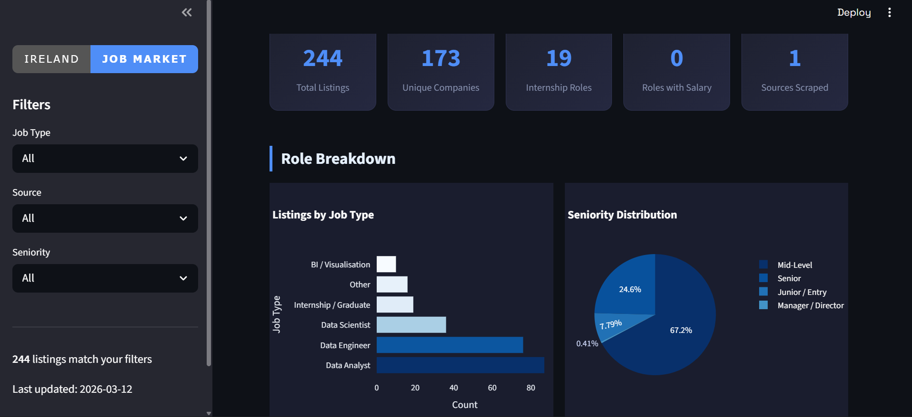
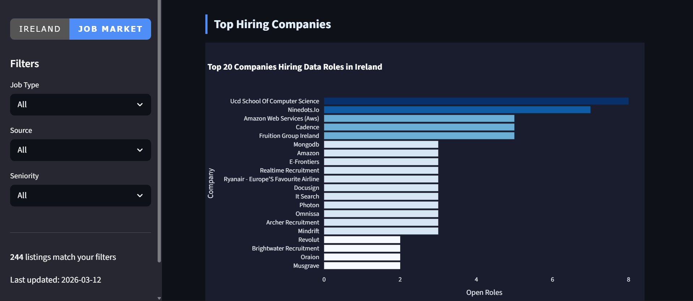
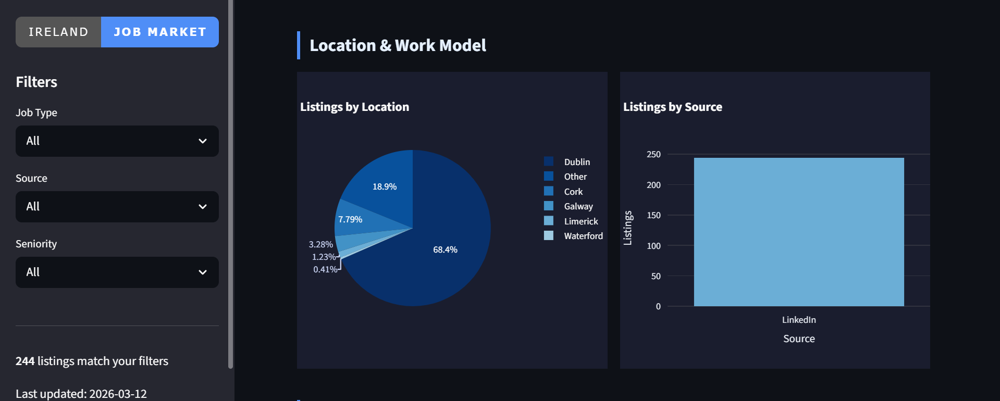

# 🇮🇪 Ireland Data Job Market Analytics

**Python · BeautifulSoup · SQLite · Streamlit · Plotly** | Live scraping · Weekly refresh via GitHub Actions

---

## The Story Behind This Project

I'm actively looking for data analyst internships in Ireland. So I decided to stop guessing what employers want and start measuring it.

This project scrapes Data Analyst, Data Scientist, Data Engineer and Internship job listings from **Linkedin**  every week, cleans and stores the data, runs SQL analysis against it, and serves everything through a live Streamlit dashboard.

The goal was not just to build a scraper. It was to answer questions that actually matter to someone trying to break into the Irish data job market:

- **Which companies are hiring the most data roles right now?**
- **What skills do Irish employers actually ask for — and which matter most for internships specifically?**
- **Which companies are most transparent about salary?**
- **Is Dublin the only option, or are Cork, Galway and Limerick worth targeting?**
- **How is demand for data roles changing week on week?**

---

## Project Pipeline

```
Indeed.ie + Jobs.ie
        ↓
Python Scraper (BeautifulSoup + requests)
        ↓
Data Cleaning & Classification (pandas)
        ↓
SQLite Database
        ↓
SQL Analytical Queries (17 queries)
        ↓
Streamlit Dashboard + Power BI
        ↓
GitHub Actions (auto-refresh every Monday)
```

---

## Tech Stack

| Tool | How I Used It |
|---|---|
| **Python (requests, BeautifulSoup)** | Scraped job listings from Indeed.ie and Jobs.ie across 6 search terms and multiple pages |
| **pandas** | Cleaned, standardised and classified raw scraped data — job type, seniority, skills extraction |
| **SQLite** | Stored all job records locally, ran 17 analytical queries using window functions, CTEs and CASE WHEN |
| **Streamlit + Plotly** | Built interactive web dashboard with filters, charts and a searchable data table |
| **GitHub Actions** | Automated weekly scrape runs every Monday — data stays fresh without manual effort |
| **Power BI** | Secondary dashboard for deeper analysis and portfolio presentation |

---

## Dashboard Screenshots





---

### 📊 KPI Overview
Total listings, unique companies, internship roles, roles with salary listed, sources scraped — all live from the database.

### 🏢 Top Hiring Companies
Ranked by number of open data roles. Filtered by job type and seniority so you can find who is specifically hiring interns or juniors right now.

### 🛠 Skills Demand
The most in-demand skills across all data roles — and a separate view for internship/graduate roles specifically. This is the chart I built for myself: what do I actually need to learn?

### 📍 Location Breakdown
Dublin dominates but the split between Dublin, Cork, Galway, Remote and Hybrid is more interesting than you'd expect.

### 📋 Browseable Listings Table
Full searchable table with every scraped listing. Download as CSV directly from the dashboard.

---

## Key Insights & Real-World Conclusions

### 1. SQL and Python Are Non-Negotiable — Everything Else Is a Bonus
Across every data role type — analyst, scientist, engineer, intern — SQL and Python appear in more listings than any other skill by a significant margin. If you are deciding what to learn first, the data is unambiguous. Excel still appears frequently for analyst roles specifically, which surprises most people.

### 2. Dublin Is Not the Only Option — But It Is 70%+ of the Market
The majority of data roles are Dublin-based, but Remote and Hybrid listings together represent a meaningful share. Cork and Galway are small but growing, particularly for larger multinationals with regional offices. For someone willing to be flexible on location, the addressable market is larger than it looks.

### 3. Most Companies Do Not List Salaries — The Ones That Do Are Worth Noting
Salary transparency in Irish job listings is low. Only a minority of listings include any salary information. The companies that consistently include salary information tend to be either large multinationals with structured HR processes or companies that are actively competing for talent. Both are good signals for a candidate.

### 4. The Skills Gap Between Junior and Senior Roles Is Smaller Than Expected
When you compare the skills listed in senior vs junior/entry-level job descriptions, the overlap is high. The difference is not the tools — it is the depth of experience with those tools. This means the fastest path to a senior role is not learning new technologies. It is building genuine depth in the ones you already have.

### 5. The Auto-Refresh Makes This a Living Dataset
Because GitHub Actions re-runs the scraper every Monday, this is not a static project. The dashboard reflects the actual state of the Irish data job market at any given week. That is the meaningful difference between this and a Kaggle dataset project — the data is real, current, and locally relevant.

---

## Getting Started

```bash
# Clone the repo
git clone https://github.com/Ishankasare/Ireland-Job-Market-Analytics

# Install dependencies
pip install -r requirements.txt

# Create required folders
mkdir -p data/processed data/raw logs

# Run the scraper (takes 5–10 minutes)
python src/scraper.py

# Launch the dashboard
streamlit run src/dashboard.py
```

Then open your browser at `http://localhost:8501`

For SQL analysis — open `sql/analysis_queries.sql` in any SQLite client (DB Browser for SQLite is free and works well) and connect to `data/jobs.db`.

---

## Project Structure

```
Ireland-Job-Market-Analytics/
│
├── README.md
├── requirements.txt
├── .gitignore
│
├── src/
│   ├── scraper.py        ← Web scraper + data cleaning pipeline
│   └── dashboard.py      ← Streamlit dashboard
│
├── sql/
│   └── analysis_queries.sql  ← 17 analytical SQL queries
│
├── data/
│   ├── raw/              ← Raw scraped data (gitignored)
│   └── processed/        ← Cleaned CSVs (committed weekly)
│
├── logs/
│   └── scraper.log       ← Scrape run logs
│
├── dashboard/
│   └── JobMarket-Ireland.pbix  ← Power BI dashboard
│
├── screenshots/
│   └── (dashboard screenshots)
│
├── .github/
│   └── workflows/
│       └── weekly_scrape.yml  ← GitHub Actions automation
│
└── INSIGHTS.md
```

---

## What I Learned

- How to build a real scraper that handles pagination, dynamic user agents, and graceful error handling
- How to clean and classify messy, inconsistent text data from two different website structures
- SQL window functions and CTEs on a real dataset I collected myself — not a pre-cleaned Kaggle file
- How to build and deploy a Streamlit dashboard with live filters, Plotly charts and a download button
- How to automate a pipeline using GitHub Actions so the data refreshes without any manual work
- Most importantly — how to frame a technical project around a real question that a real person (me) actually needs answered

---

*Data scraped from Indeed.ie and Jobs.ie · Refreshed weekly · Built in Dublin, Ireland*
